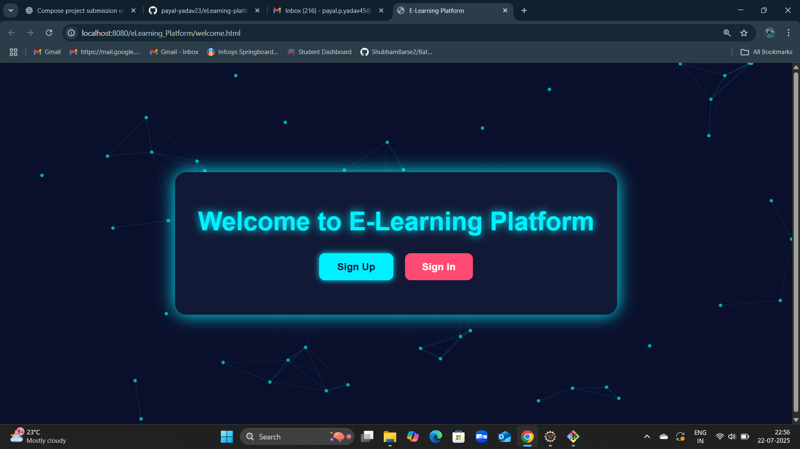
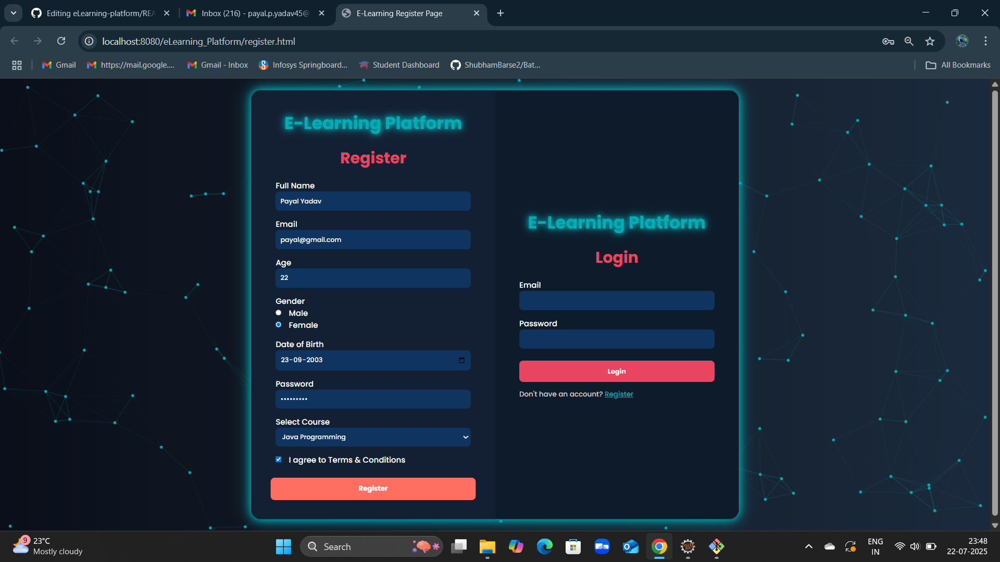
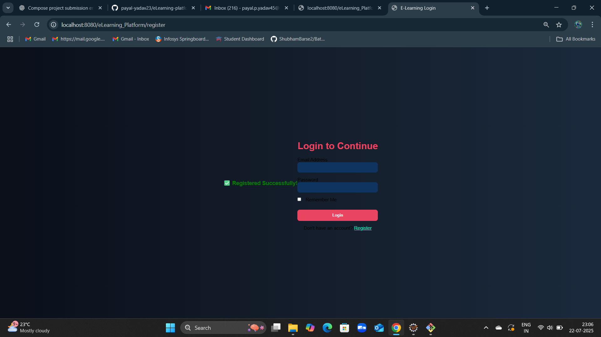

# 📚 E-Learning Platform using JavaServlet

A simple web-based E-Learning Platform built using Java Servlets and @WebServlet Annotation, JDBC for database connectivity, and front-end technologies like HTML, CSS, and JavaScript.

## 🚀 Features

- 📝 **User Registration**: Register new learners using an interactive form.
- 🔐 **User Login**: Secure login for registered users.
- 📊 **Dashboard Page**: Personalized dashboard after login.
- 💾 **Database Connectivity**: Uses JDBC to store and retrieve data from MySQL database.
- 🎨 **Responsive UI**: Designed with HTML, CSS, and JavaScript.

---

## 🛠️ Technologies Used

- **Backend**: Java Servlets, JDBC
- **Frontend**: HTML, CSS, JavaScript
- **Database**: MySQL
- **Tools**: Eclipse IDE, Apache Tomcat version 10.1, GitHub

```

## 📁 Project Structure

eLearning-platform/
│
├── src/
│ └── com.learning/
│ ├── Register.java
│ ├── Login.java
│ └── DashboardServlet.java (not yet completed)
│
├── webapp/
│ ├── register.html
│ ├── login.html
│ ├── dashboard.jsp
│ ├── css/
│ │ └── register.css
| | └── login.css
│ └── js/
│ └── script.js
│
│
└── README.md
```

## 📸 Project Screenshots

### 🔹 Welcome Page


### 🔹 Register & Login Page


### 🔹 Registration Success Page


## ⚙️ How to Run

1. **Clone the Repository**:
   ```bash
   git clone https://github.com/payal-yadav23/eLearning-platform.git
- Import in Eclipse:

File > Import > Dynamic Web Project

Select the cloned folder

- Configure Database:

Create a MySQL database (e.g., elearning_db)

Create required tables (e.g., users)

Update DB credentials in JDBC connection code

-  Run on Tomcat Server:

Right-click the project → Run on Server

🧪 Pages Included
register.html – Registration form with validation

login.html – Secure login form

dashboard.jsp – Welcome page after login

style.css – Custom styling

script.js – Front-end validation/animations

📌 Author
Payal Yadav
